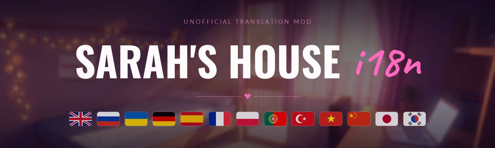
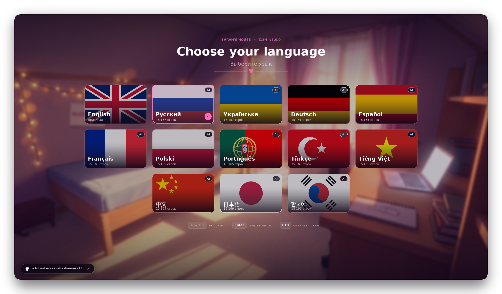

<div align="center">



[<kbd> English </kbd>](../../README.md)
[<kbd> Русский </kbd>](README.ru.md)
[<kbd> Українська </kbd>](README.uk.md)
<kbd> ● Deutsch </kbd>
[<kbd> Español </kbd>](README.es.md)
[<kbd> Français </kbd>](README.fr.md)
[<kbd> Polski </kbd>](README.pl.md)
[<kbd> Português </kbd>](README.pt.md)
[<kbd> Türkçe </kbd>](README.tr.md)
[<kbd> Tiếng Việt </kbd>](README.vi.md)
[<kbd> 中文 </kbd>](README.zh.md)
[<kbd> 日本語 </kbd>](README.ja.md)
[<kbd> 한국어 </kbd>](README.ko.md)

<br>

[](https://github.com/elofaster/sarahs-house-i18n/releases/latest)

[](https://github.com/BepInEx/BepInEx)

Der Mod übersetzt **Sarah's House** in 12 Sprachen. Die Sprache wird beim ersten Start
gewählt und lässt sich später mit **F10** im Hauptmenü ändern. Spieldateien bleiben unangetastet.

<a href="https://github.com/elofaster/sarahs-house-i18n/releases/latest"></a>



</div>


1. Lade `SarahsHouse-i18n-v3.0.0.zip` von der [Releases-Seite](https://github.com/elofaster/sarahs-house-i18n/releases/latest) herunter.
2. Entpacke das Archiv in den Spielordner — dorthin, wo `SarahsHouse.exe` liegt.
3. Starte das Spiel. Der erste Start dauert ein bis zwei Minuten länger: BepInEx richtet sich einmalig für deine Kopie ein. Danach öffnet sich die Sprachauswahl von selbst.

So sollte es aussehen:

```text
SarahsHouse/
├─ SarahsHouse.exe          ← das Spiel
├─ winhttp.dll              ┐
├─ doorstop_config.ini      │  aus dem Archiv
├─ dotnet/                  │
└─ BepInEx/                 ┘
```

<details>
<summary>BepInEx 6 IL2CPP läuft bereits</summary>
<br>

Dann genügt es, `SarahsHouseI18n/` nach `BepInEx/plugins/` zu kopieren. Details in [docs/INSTALL.md](../INSTALL.md).

</details>

<br>


<details>
<summary>Der erste Start dauert sehr lange</summary>
<br>

Das ist normal: BepInEx generiert Assemblies für deine Spielkopie. Das passiert nur einmal — alle weiteren Starts sind gewohnt schnell.

</details>
<details>
<summary>Der Virenscanner meldet <code>winhttp.dll</code></summary>
<br>

Das ist der BepInEx-Loader, Standard bei Unity-Mods. Stelle die Datei aus der Quarantäne wieder her und füge den Spielordner den Ausnahmen hinzu.

</details>
<details>
<summary>Nach einem Spiel-Update ist manches wieder Englisch</summary>
<br>

Neue und geänderte Zeilen sind noch nicht übersetzt — sie erscheinen auf Englisch, das Spiel läuft normal weiter. Aktualisiere den Mod, sobald eine neue Version erscheint.

</details>
<details>
<summary>Wie entferne ich den Mod</summary>
<br>

Lösche den Ordner `BepInEx/plugins/SarahsHouseI18n`. Um auch BepInEx zu entfernen, lösche zusätzlich `winhttp.dll`. Das Spiel ist danach wieder im Originalzustand.

</details>

<br>


Die Übersetzungspakete sind einfache JSON-Dateien in [`packs/`](../../packs): Schlüssel ist die englische Zeile, Wert die Übersetzung. In einer installierten Kopie liegen dieselben Dateien in `BepInEx/plugins/SarahsHouseI18n/i18n/` — Änderungen greifen nach einem Neustart des Spiels.

Eine neue Sprache lässt sich ohne Neubau des Mods hinzufügen — Anleitung in [docs/ADD-LANGUAGE.md](../ADD-LANGUAGE.md). Pull Requests sind willkommen.

<div align="center">


<a href="https://github.com/elofaster/sarahs-house-i18n"></a>

<a href="https://github.com/elofaster"></a>

Schriften — SIL OFL / Apache 2.0, Liste in [THIRD-PARTY-NOTICES.md](../../THIRD-PARTY-NOTICES.md) · läuft auf [BepInEx](https://github.com/BepInEx/BepInEx)

Nicht mit dem Autor des Spiels verbunden.

</div>
