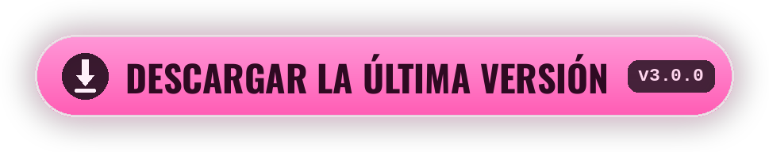

<div align="center">


[<kbd> English </kbd>](../../README.md)
[<kbd> Русский </kbd>](README.ru.md)
[<kbd> Українська </kbd>](README.uk.md)
[<kbd> Deutsch </kbd>](README.de.md)
<kbd> ● Español </kbd>
[<kbd> Français </kbd>](README.fr.md)
[<kbd> Polski </kbd>](README.pl.md)
[<kbd> Português </kbd>](README.pt.md)
[<kbd> Türkçe </kbd>](README.tr.md)
[<kbd> Tiếng Việt </kbd>](README.vi.md)
[<kbd> 中文 </kbd>](README.zh.md)
[<kbd> 日本語 </kbd>](README.ja.md)
[<kbd> 한국어 </kbd>](README.ko.md)

<br>

[](https://github.com/elofaster/sarahs-house-i18n/releases/latest)

[](https://github.com/BepInEx/BepInEx)

El mod traduce **Sarah's House** a 12 idiomas. El idioma se elige en el primer arranque
y luego se cambia con **F10** en el menú principal. Los archivos del juego no se tocan.

<a href="https://github.com/elofaster/sarahs-house-i18n/releases/latest"></a>


</div>


1. Descarga `SarahsHouse-i18n-v3.0.0.zip` desde la [página de releases](https://github.com/elofaster/sarahs-house-i18n/releases/latest).
2. Extrae el archivo en la carpeta del juego, donde está `SarahsHouse.exe`.
3. Inicia el juego. El primer arranque tarda uno o dos minutos más: BepInEx se configura una sola vez para tu copia. Después el selector de idioma se abre solo.

Debería quedar así:

```text
SarahsHouse/
├─ SarahsHouse.exe          ← el juego
├─ winhttp.dll              ┐
├─ doorstop_config.ini      │  del archivo
├─ dotnet/                  │
└─ BepInEx/                 ┘
```

<details>
<summary>Ya tienes BepInEx 6 IL2CPP</summary>
<br>

Basta con copiar `SarahsHouseI18n/` en `BepInEx/plugins/`. Detalles en [docs/INSTALL.md](../INSTALL.md).

</details>

<br>


Los 12 idiomas fueron traducidos por **Claude Opus 4.8** (Anthropic) — íntegramente, unas 15 000 líneas por idioma.

La traducción no se hizo línea a línea: el modelo ve la escena completa, así que los diálogos conservan la voz de cada personaje. Opus 4.8 es el modelo insignia de Anthropic y uno de los más fuertes en traducción hoy.

<br>


<details>
<summary>El primer arranque tarda mucho</summary>
<br>

Es lo esperado: BepInEx genera los ensamblados para tu copia del juego. Ocurre una sola vez; los siguientes arranques son normales.

</details>
<details>
<summary>El antivirus se queja de <code>winhttp.dll</code></summary>
<br>

Es el cargador de BepInEx, estándar en los mods de Unity. Restaura el archivo de la cuarentena y añade la carpeta del juego a las exclusiones.

</details>
<details>
<summary>Tras una actualización del juego, parte del texto vuelve a estar en inglés</summary>
<br>

Las líneas nuevas o cambiadas aún no están traducidas: se muestran en inglés y el juego sigue funcionando. Actualiza el mod cuando salga una versión nueva.

</details>
<details>
<summary>Cómo quitar el mod</summary>
<br>

Borra la carpeta `BepInEx/plugins/SarahsHouseI18n`. Para quitar también BepInEx, borra además `winhttp.dll`. El juego vuelve a su estado original.

</details>

<br>


Los paquetes de traducción son JSON planos en [`packs/`](../../packs): la clave es la línea en inglés y el valor, la traducción. En una copia instalada, los mismos archivos están en `BepInEx/plugins/SarahsHouseI18n/i18n/`; los cambios se ven tras reiniciar el juego.

Se puede añadir un idioma nuevo sin recompilar el mod — instrucciones en [docs/ADD-LANGUAGE.md](../ADD-LANGUAGE.md). Los pull requests son bienvenidos.


**Sarah's House** es obra de **AceStudio** — el mod contiene solo la traducción; el juego no va incluido.

Si la traducción te sirvió, apoya al desarrollador: compra el juego y deja una reseña.

[Steam](https://store.steampowered.com/app/4712060/Sarahs_House) · [itch.io](https://ace-stud.itch.io/sarahs-house)

<div align="center">


<a href="https://github.com/elofaster/sarahs-house-i18n"></a>

<a href="https://github.com/elofaster"></a>

fuentes — SIL OFL / Apache 2.0, lista en [THIRD-PARTY-NOTICES.md](../../THIRD-PARTY-NOTICES.md) · funciona sobre [BepInEx](https://github.com/BepInEx/BepInEx)

Sin relación con el autor del juego.

</div>
