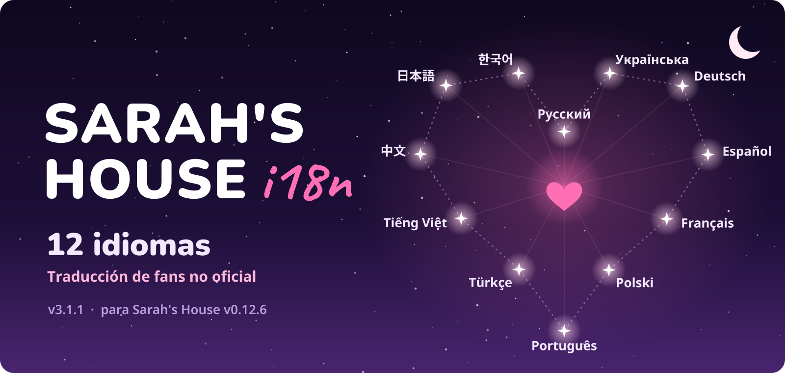

<p align="center">
  
</p>

<p align="center">
  <a href="https://github.com/elofaster/sarahs-house-i18n/releases/latest"></a>
  &nbsp;
  <a href="https://discord.gg/FXsWMq9Rv7"></a>
</p>

<p align="center">
<a href="../../README.md">English</a> &nbsp;✦&nbsp; <a href="README.ru.md">Русский</a> &nbsp;✦&nbsp; <a href="README.uk.md">Українська</a> &nbsp;✦&nbsp; <a href="README.de.md">Deutsch</a> &nbsp;✦&nbsp; <b>Español</b> &nbsp;✦&nbsp; <a href="README.fr.md">Français</a> &nbsp;✦&nbsp; <a href="README.pl.md">Polski</a> &nbsp;✦&nbsp; <a href="README.pt.md">Português</a> &nbsp;✦&nbsp; <a href="README.tr.md">Türkçe</a> &nbsp;✦&nbsp; <a href="README.vi.md">Tiếng&nbsp;Việt</a> &nbsp;✦&nbsp; <a href="README.zh.md">中⁠文</a> &nbsp;✦&nbsp; <a href="README.ja.md">日⁠本⁠語</a> &nbsp;✦&nbsp; <a href="README.ko.md">한⁠국⁠어</a>
</p>

<br>


<p align="center"><sub>El juego no está incluido. Necesitas tu propia copia. <a href="https://store.steampowered.com/app/4712060/Sarahs_House" title="Comprar en Steam">Steam</a> · <a href="https://ace-stud.itch.io/sarahs-house" title="Consíguelo en itch.io">itch.io</a></sub></p>

## ✦ Instalación

1. Descarga `SarahsHouse-i18n-v3.1.1.zip` desde la [página de versiones](https://github.com/elofaster/sarahs-house-i18n/releases/latest).
2. Descomprime el archivo en la carpeta del juego, la que contiene `SarahsHouse.exe`. Combina, no anides: las carpetas del archivo quedan junto al exe.
3. Inicia el juego. El primer arranque tarda un par de minutos más mientras BepInEx se configura para tu copia, después el selector de idioma se abre solo.

Después, la carpeta queda así:

```text
SarahsHouse/
├─ SarahsHouse.exe
├─ winhttp.dll
├─ doorstop_config.ini
├─ dotnet/
└─ BepInEx/
    └─ plugins/
        └─ SarahsHouseI18n/
```

`winhttp.dll`, `doorstop_config.ini`, `dotnet/` y `BepInEx/` vienen del archivo; el mod es la última carpeta.

<details>
<summary><b>¿Ya tienes BepInEx 6 IL2CPP?</b></summary>

Entonces solo necesitas el mod: copia `BepInEx/plugins/SarahsHouseI18n/` del archivo a tu propia carpeta `BepInEx/plugins/` y abre el juego. No hace falta nada más del archivo, y el idioma que elijas se recuerda en cada instalación.

</details>

<details>
<summary><b>Cambiar el idioma más tarde</b></summary>

Pulsa <kbd>F10</kbd> en el menú principal. El selector aparece sobre la escena con el idioma actual en el centro de la rueda, y al confirmar el texto cambia al instante.

</details>

## ✦ El selector


Ratón, flechas o mando. <kbd>Enter</kbd> confirma, <kbd>F10</kbd> vuelve a abrir el selector.

## ✦ Si algo salió mal

<details>
<summary><b>El primer arranque tarda una eternidad</b></summary>

Es normal. BepInEx genera los ensamblados para tu copia del juego la primera vez, uno o dos minutos, una sola vez. Los siguientes arranques van a velocidad normal.
</details>

<details>
<summary><b>Mi antivirus marca <code>winhttp.dll</code></b></summary>

Ese archivo es el cargador de BepInEx y es habitual en los mods de Unity. Restáuralo de la cuarentena y añade la carpeta del juego a las exclusiones.
</details>

<details>
<summary><b>Algunas líneas vuelven al inglés tras actualizar el juego</b></summary>

Las líneas nuevas y modificadas aún no están traducidas, así que caen al inglés y el juego sigue funcionando. La siguiente versión del mod cierra el hueco.
</details>

<details>
<summary><b>¿Cómo quito el mod?</b></summary>

Borra `BepInEx/plugins/SarahsHouseI18n`. Si quieres quitar también BepInEx, borra además `winhttp.dll`, `doorstop_config.ini` y `dotnet/`. El juego vuelve a como venía.
</details>

---

<p align="center"><sub>
v3.1.1 · Sarah's House v0.12.6 · <a href="https://github.com/BepInEx/BepInEx">BepInEx</a> 6 IL2CPP<br>
Las fuentes se incluyen bajo SIL OFL y Apache 2.0. Funciona sobre BepInEx. Traducción de fans no oficial, sin relación con AceStudio.
</sub></p>
