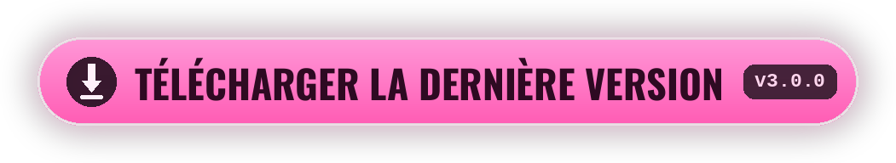

<div align="center">


[<kbd> English </kbd>](../../README.md)
[<kbd> Русский </kbd>](README.ru.md)
[<kbd> Українська </kbd>](README.uk.md)
[<kbd> Deutsch </kbd>](README.de.md)
[<kbd> Español </kbd>](README.es.md)
<kbd> ● Français </kbd>
[<kbd> Polski </kbd>](README.pl.md)
[<kbd> Português </kbd>](README.pt.md)
[<kbd> Türkçe </kbd>](README.tr.md)
[<kbd> Tiếng Việt </kbd>](README.vi.md)
[<kbd> 中文 </kbd>](README.zh.md)
[<kbd> 日本語 </kbd>](README.ja.md)
[<kbd> 한국어 </kbd>](README.ko.md)

<br>

[](https://github.com/elofaster/sarahs-house-i18n/releases/latest)

[](https://github.com/BepInEx/BepInEx)

Le mod traduit **Sarah's House** en 12 langues. La langue se choisit au premier lancement
et se change ensuite avec **F10** dans le menu principal. Les fichiers du jeu ne sont pas modifiés.

<a href="https://github.com/elofaster/sarahs-house-i18n/releases/latest"></a>


</div>


1. Téléchargez `SarahsHouse-i18n-v3.0.0.zip` depuis la [page des releases](https://github.com/elofaster/sarahs-house-i18n/releases/latest).
2. Extrayez l'archive dans le dossier du jeu — là où se trouve `SarahsHouse.exe`.
3. Lancez le jeu. Le premier démarrage prend une à deux minutes de plus : BepInEx se configure une seule fois pour votre copie. Ensuite le sélecteur de langue s'ouvre tout seul.

Vous devriez obtenir ceci :

```text
SarahsHouse/
├─ SarahsHouse.exe          ← le jeu
├─ winhttp.dll              ┐
├─ doorstop_config.ini      │  de l'archive
├─ dotnet/                  │
└─ BepInEx/                 ┘
```

<details>
<summary>BepInEx 6 IL2CPP déjà installé</summary>
<br>

Copiez simplement `SarahsHouseI18n/` dans `BepInEx/plugins/`. Détails dans [docs/INSTALL.md](../INSTALL.md).

</details>

<br>


Les 12 langues ont été traduites par **Claude Opus 4.8** (Anthropic) — intégralement, environ 15 000 lignes par langue.

La traduction ne s'est pas faite ligne par ligne : le modèle voit la scène entière, les répliques gardent donc la voix de chaque personnage. Opus 4.8 est le modèle phare d'Anthropic et l'un des plus forts en traduction aujourd'hui.

<br>


<details>
<summary>Le premier lancement est très long</summary>
<br>

C'est normal : BepInEx génère les assemblies pour votre copie du jeu. Cela n'arrive qu'une fois — les lancements suivants sont normaux.

</details>
<details>
<summary>L'antivirus râle sur <code>winhttp.dll</code></summary>
<br>

C'est le chargeur de BepInEx, standard pour les mods Unity. Restaurez le fichier de la quarantaine et ajoutez le dossier du jeu aux exclusions.

</details>
<details>
<summary>Après une mise à jour du jeu, du texte repasse en anglais</summary>
<br>

Les lignes nouvelles ou modifiées ne sont pas encore traduites : elles s'affichent en anglais et le jeu continue de fonctionner. Mettez le mod à jour dès qu'une nouvelle version sort.

</details>
<details>
<summary>Comment désinstaller le mod</summary>
<br>

Supprimez le dossier `BepInEx/plugins/SarahsHouseI18n`. Pour retirer aussi BepInEx, supprimez également `winhttp.dll`. Le jeu revient à son état d'origine.

</details>

<br>


Les packs de traduction sont de simples JSON dans [`packs/`](../../packs) : la clé est la ligne anglaise, la valeur la traduction. Dans une copie installée, les mêmes fichiers sont dans `BepInEx/plugins/SarahsHouseI18n/i18n/` — les modifications apparaissent après un redémarrage du jeu.

Une nouvelle langue s'ajoute sans recompiler le mod — voir [docs/ADD-LANGUAGE.md](../ADD-LANGUAGE.md). Les pull requests sont les bienvenues.


**Sarah's House** est développé par **AceStudio** — le mod ne contient que la traduction, le jeu n'est pas inclus.

Si la traduction vous a été utile, soutenez le développeur : achetez le jeu et laissez un avis.

[Steam](https://store.steampowered.com/app/4712060/Sarahs_House) · [itch.io](https://ace-stud.itch.io/sarahs-house)

<div align="center">


<a href="https://github.com/elofaster/sarahs-house-i18n"></a>

<a href="https://github.com/elofaster"></a>

polices — SIL OFL / Apache 2.0, liste dans [THIRD-PARTY-NOTICES.md](../../THIRD-PARTY-NOTICES.md) · fonctionne sur [BepInEx](https://github.com/BepInEx/BepInEx)

Sans lien avec l'auteur du jeu.

</div>
