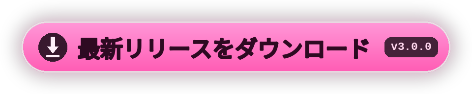

<div align="center">


[<kbd> English </kbd>](../../README.md)
[<kbd> Русский </kbd>](README.ru.md)
[<kbd> Українська </kbd>](README.uk.md)
[<kbd> Deutsch </kbd>](README.de.md)
[<kbd> Español </kbd>](README.es.md)
[<kbd> Français </kbd>](README.fr.md)
[<kbd> Polski </kbd>](README.pl.md)
[<kbd> Português </kbd>](README.pt.md)
[<kbd> Türkçe </kbd>](README.tr.md)
[<kbd> Tiếng Việt </kbd>](README.vi.md)
[<kbd> 中文 </kbd>](README.zh.md)
<kbd> ● 日本語 </kbd>
[<kbd> 한국어 </kbd>](README.ko.md)

<br>

[](https://github.com/elofaster/sarahs-house-i18n/releases/latest)

[](https://github.com/BepInEx/BepInEx)

この MOD は **Sarah's House** を 12 言語に翻訳します。言語は初回起動時に選び、
あとからメインメニューの **F10** で変更できます。ゲームのファイルには手を加えません。

<a href="https://github.com/elofaster/sarahs-house-i18n/releases/latest"></a>


</div>


1. [リリースページ](https://github.com/elofaster/sarahs-house-i18n/releases/latest)から `SarahsHouse-i18n-v3.0.0.zip` をダウンロード。
2. アーカイブをゲームフォルダ（`SarahsHouse.exe` のある場所）に展開。
3. ゲームを起動。初回だけ 1〜2 分長くかかります: BepInEx があなたのコピーに合わせて一度だけセットアップします。その後、言語選択メニューが自動で開きます。

こうなっていれば OK:

```text
SarahsHouse/
├─ SarahsHouse.exe          ← ゲーム本体
├─ winhttp.dll              ┐
├─ doorstop_config.ini      │  アーカイブから
├─ dotnet/                  │
└─ BepInEx/                 ┘
```

<details>
<summary>BepInEx 6 IL2CPP を導入済みの場合</summary>
<br>

`SarahsHouseI18n/` を `BepInEx/plugins/` にコピーするだけです。詳細は [docs/INSTALL.md](../INSTALL.md)。

</details>

<br>


12 言語すべてを **Claude Opus 4.8**（Anthropic）が翻訳 — 各言語およそ 15,000 行を完全翻訳。

翻訳は一行ずつではありません: モデルはシーン全体を見るため、セリフは各キャラクターの声を保ちます。Opus 4.8 は Anthropic のフラッグシップモデルで、現在もっとも翻訳に強いモデルのひとつです。

<br>


<details>
<summary>初回起動がとても長い</summary>
<br>

正常です: BepInEx があなたのゲームコピー用のアセンブリを生成しています。一度きりで、以降の起動は通常どおりです。

</details>
<details>
<summary>ウイルス対策ソフトが <code>winhttp.dll</code> に反応する</summary>
<br>

Unity MOD で標準の BepInEx ローダーです。ファイルを隔離から復元し、ゲームフォルダを除外設定に追加してください。

</details>
<details>
<summary>ゲーム更新後、一部が英語に戻った</summary>
<br>

新規・変更された行はまだ未翻訳のため英語で表示されますが、ゲームは正常に動きます。新しい版が出たら MOD を更新してください。

</details>
<details>
<summary>MOD の削除方法</summary>
<br>

`BepInEx/plugins/SarahsHouseI18n` フォルダを削除します。BepInEx ごと外すなら `winhttp.dll` も削除。ゲームは元の状態に戻ります。

</details>

<br>


翻訳パックは [`packs/`](../../packs) にあるただの JSON です: キーが英語原文、値が訳文。インストール済みのコピーでは同じファイルが `BepInEx/plugins/SarahsHouseI18n/i18n/` にあり、編集はゲーム再起動後に反映されます。

新しい言語は MOD を再ビルドせずに追加できます — 手順は [docs/ADD-LANGUAGE.md](../ADD-LANGUAGE.md)。Pull Request 歓迎です。


**Sarah's House** は **AceStudio** の作品です — この MOD に含まれるのは翻訳のみで、ゲーム本体は含まれません。

翻訳が役に立ったら、開発者を応援してください: ゲームを購入してレビューを残しましょう。

[Steam](https://store.steampowered.com/app/4712060/Sarahs_House) · [itch.io](https://ace-stud.itch.io/sarahs-house)

<div align="center">


<a href="https://github.com/elofaster/sarahs-house-i18n"></a>

<a href="https://github.com/elofaster"></a>

フォント — SIL OFL / Apache 2.0、一覧は [THIRD-PARTY-NOTICES.md](../../THIRD-PARTY-NOTICES.md) · [BepInEx](https://github.com/BepInEx/BepInEx) 上で動作

ゲーム作者とは無関係です。

</div>
