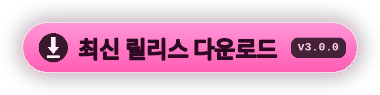

<div align="center">


[<kbd> English </kbd>](../../README.md)
[<kbd> Русский </kbd>](README.ru.md)
[<kbd> Українська </kbd>](README.uk.md)
[<kbd> Deutsch </kbd>](README.de.md)
[<kbd> Español </kbd>](README.es.md)
[<kbd> Français </kbd>](README.fr.md)
[<kbd> Polski </kbd>](README.pl.md)
[<kbd> Português </kbd>](README.pt.md)
[<kbd> Türkçe </kbd>](README.tr.md)
[<kbd> Tiếng Việt </kbd>](README.vi.md)
[<kbd> 中文 </kbd>](README.zh.md)
[<kbd> 日本語 </kbd>](README.ja.md)
<kbd> ● 한국어 </kbd>

<br>

[](https://github.com/elofaster/sarahs-house-i18n/releases/latest)

[](https://github.com/BepInEx/BepInEx)

이 모드는 **Sarah's House** 를 12개 언어로 번역합니다. 언어는 첫 실행에서 고르고,
이후 메인 메뉴에서 **F10** 으로 바꿉니다. 게임 파일은 건드리지 않습니다.

<a href="https://github.com/elofaster/sarahs-house-i18n/releases/latest"></a>


</div>


1. [릴리스 페이지](https://github.com/elofaster/sarahs-house-i18n/releases/latest)에서 `SarahsHouse-i18n-v3.0.0.zip` 을 받습니다.
2. 압축을 게임 폴더에, `SarahsHouse.exe` 가 있는 곳에 풉니다.
3. 게임을 실행합니다. 첫 실행은 1–2분 더 걸립니다: BepInEx 가 당신의 사본에 맞춰 한 번만 설정합니다. 그 후 언어 선택 메뉴가 저절로 열립니다.

이렇게 되어 있으면 됩니다:

```text
SarahsHouse/
├─ SarahsHouse.exe          ← 게임 본체
├─ winhttp.dll              ┐
├─ doorstop_config.ini      │  압축 파일에서
├─ dotnet/                  │
└─ BepInEx/                 ┘
```

<details>
<summary>이미 BepInEx 6 IL2CPP 사용 중</summary>
<br>

`SarahsHouseI18n/` 를 `BepInEx/plugins/` 에 복사하면 끝. 자세한 내용은 [docs/INSTALL.md](../INSTALL.md).

</details>

<br>


12개 언어 전부를 **Claude Opus 4.8** (Anthropic) 이 번역했습니다 — 언어당 약 15,000줄, 전체 번역.

번역은 한 줄씩 하지 않았습니다: 모델이 장면 전체를 보기 때문에 대사가 각 캐릭터의 목소리를 유지합니다. Opus 4.8 은 Anthropic 의 플래그십 모델이며 현재 번역에서 가장 강력한 모델 중 하나입니다.

<br>


<details>
<summary>첫 실행이 너무 오래 걸려요</summary>
<br>

정상입니다: BepInEx 가 당신의 게임 사본용 어셈블리를 생성하는 중입니다. 한 번만 일어나며, 이후 실행은 평소와 같습니다.

</details>
<details>
<summary>백신이 <code>winhttp.dll</code> 을 잡아요</summary>
<br>

Unity 모드의 표준인 BepInEx 로더입니다. 파일을 격리에서 복원하고 게임 폴더를 예외에 추가하세요.

</details>
<details>
<summary>게임 업데이트 후 일부가 다시 영어로 나와요</summary>
<br>

새로 생기거나 바뀐 줄은 아직 번역이 없어 영어로 표시되고, 게임은 정상 동작합니다. 새 버전이 나오면 모드를 업데이트하세요.

</details>
<details>
<summary>모드 삭제 방법</summary>
<br>

`BepInEx/plugins/SarahsHouseI18n` 폴더를 삭제하세요. BepInEx 까지 지우려면 `winhttp.dll` 도 삭제. 게임은 원래 상태로 돌아갑니다.

</details>

<br>


번역 팩은 [`packs/`](../../packs) 의 순수 JSON 입니다: 키는 영어 원문, 값은 번역. 설치된 사본에서는 같은 파일이 `BepInEx/plugins/SarahsHouseI18n/i18n/` 에 있으며, 수정은 게임 재시작 후 반영됩니다.

모드를 다시 빌드하지 않고 새 언어를 추가할 수 있습니다 — 방법은 [docs/ADD-LANGUAGE.md](../ADD-LANGUAGE.md). Pull Request 환영합니다.


**Sarah's House** 는 **AceStudio** 가 만듭니다 — 이 모드에는 번역만 들어 있고 게임 본체는 포함되지 않습니다.

번역이 도움이 됐다면 개발자를 응원해 주세요: 게임을 구매하고 리뷰를 남겨 주세요.

[Steam](https://store.steampowered.com/app/4712060/Sarahs_House) · [itch.io](https://ace-stud.itch.io/sarahs-house)

<div align="center">


<a href="https://github.com/elofaster/sarahs-house-i18n"></a>

<a href="https://github.com/elofaster"></a>

폰트 — SIL OFL / Apache 2.0, 목록은 [THIRD-PARTY-NOTICES.md](../../THIRD-PARTY-NOTICES.md) · [BepInEx](https://github.com/BepInEx/BepInEx) 위에서 동작

게임 제작자와는 무관합니다.

</div>
