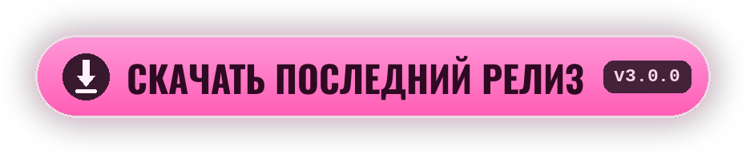

<div align="center">


[<kbd> English </kbd>](../../README.md)
<kbd> ● Русский </kbd>
[<kbd> Українська </kbd>](README.uk.md)
[<kbd> Deutsch </kbd>](README.de.md)
[<kbd> Español </kbd>](README.es.md)
[<kbd> Français </kbd>](README.fr.md)
[<kbd> Polski </kbd>](README.pl.md)
[<kbd> Português </kbd>](README.pt.md)
[<kbd> Türkçe </kbd>](README.tr.md)
[<kbd> Tiếng Việt </kbd>](README.vi.md)
[<kbd> 中文 </kbd>](README.zh.md)
[<kbd> 日本語 </kbd>](README.ja.md)
[<kbd> 한국어 </kbd>](README.ko.md)

<br>

[](https://github.com/elofaster/sarahs-house-i18n/releases/latest)

[](https://github.com/BepInEx/BepInEx)

Мод переводит **Sarah's House** на 12 языков. Язык выбирается при первом запуске,
дальше меняется по **F10** в главном меню. Файлы игры мод не трогает.

<a href="https://github.com/elofaster/sarahs-house-i18n/releases/latest"></a>


</div>


1. Скачайте `SarahsHouse-i18n-v3.0.0.zip` со [страницы релизов](https://github.com/elofaster/sarahs-house-i18n/releases/latest).
2. Распакуйте архив в папку игры — туда, где лежит `SarahsHouse.exe`.
3. Запустите игру. Первый запуск дольше обычного, минута-две: BepInEx один раз настраивается под вашу копию. Дальше меню выбора языка откроется само.

Должно получиться так:

```text
SarahsHouse/
├─ SarahsHouse.exe          ← игра
├─ winhttp.dll              ┐
├─ doorstop_config.ini      │  из архива
├─ dotnet/                  │
└─ BepInEx/                 ┘
```

<details>
<summary>Уже стоит BepInEx 6 IL2CPP</summary>
<br>

Достаточно скопировать `SarahsHouseI18n/` в `BepInEx/plugins/`. Подробности — в [docs/INSTALL.md](../INSTALL.md).

</details>

<br>


Все 12 языков переведены моделью **Claude Opus 4.8** (Anthropic) — целиком, около 15 000 строк на каждый язык.

Перевод делался не построчно: модель видит сцену целиком, поэтому реплики держат характер персонажей. Opus 4.8 — флагманская модель Anthropic, одна из сильнейших в переводе на сегодня.

<br>


<details>
<summary>Первый запуск очень долгий</summary>
<br>

Так и должно быть: BepInEx генерирует сборки под вашу копию игры. Это разовая операция, все следующие запуски — обычные.

</details>
<details>
<summary>Антивирус ругается на <code>winhttp.dll</code></summary>
<br>

Это загрузчик BepInEx, стандартный для Unity-модов. Верните файл из карантина и добавьте папку игры в исключения.

</details>
<details>
<summary>После обновления игры часть текста снова на английском</summary>
<br>

Новые и изменённые строки ещё не переведены — они показываются на английском, игра при этом работает нормально. Обновите мод, когда выйдет свежая версия.

</details>
<details>
<summary>Как удалить мод</summary>
<br>

Удалите папку `BepInEx/plugins/SarahsHouseI18n`. Если хотите убрать и сам BepInEx — удалите ещё `winhttp.dll`. Игра вернётся в исходное состояние.

</details>

<br>


Пакеты переводов — обычные JSON в [`packs/`](../../packs): ключ — английская строка, значение — перевод. В установленном моде те же файлы лежат в `BepInEx/plugins/SarahsHouseI18n/i18n/` — правка видна после перезапуска игры.

Новый язык добавляется без пересборки мода — инструкция в [docs/ADD-LANGUAGE.md](../ADD-LANGUAGE.md). Пулреквесты приветствуются.


**Sarah's House** делает **AceStudio** — мод содержит только перевод, сама игра в него не входит.

Если перевод оказался полезен, поддержите разработчика: купите игру и оставьте отзыв.

[Steam](https://store.steampowered.com/app/4712060/Sarahs_House) · [itch.io](https://ace-stud.itch.io/sarahs-house)

<div align="center">


<a href="https://github.com/elofaster/sarahs-house-i18n"></a>

<a href="https://github.com/elofaster"></a>

шрифты — SIL OFL / Apache 2.0, список в [THIRD-PARTY-NOTICES.md](../../THIRD-PARTY-NOTICES.md) · работает на [BepInEx](https://github.com/BepInEx/BepInEx)

К автору игры отношения не имею.

</div>
