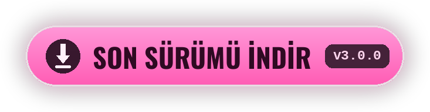

<div align="center">


[<kbd> English </kbd>](../../README.md)
[<kbd> Русский </kbd>](README.ru.md)
[<kbd> Українська </kbd>](README.uk.md)
[<kbd> Deutsch </kbd>](README.de.md)
[<kbd> Español </kbd>](README.es.md)
[<kbd> Français </kbd>](README.fr.md)
[<kbd> Polski </kbd>](README.pl.md)
[<kbd> Português </kbd>](README.pt.md)
<kbd> ● Türkçe </kbd>
[<kbd> Tiếng Việt </kbd>](README.vi.md)
[<kbd> 中文 </kbd>](README.zh.md)
[<kbd> 日本語 </kbd>](README.ja.md)
[<kbd> 한국어 </kbd>](README.ko.md)

<br>

[](https://github.com/elofaster/sarahs-house-i18n/releases/latest)

[](https://github.com/BepInEx/BepInEx)

Mod, **Sarah's House** oyununu 12 dile çevirir. Dil ilk açılışta seçilir,
sonra ana menüde **F10** ile değiştirilir. Oyun dosyalarına dokunulmaz.

<a href="https://github.com/elofaster/sarahs-house-i18n/releases/latest"></a>


</div>


1. [Sürümler sayfasından](https://github.com/elofaster/sarahs-house-i18n/releases/latest) `SarahsHouse-i18n-v3.0.0.zip` dosyasını indirin.
2. Arşivi oyun klasörüne çıkartın — `SarahsHouse.exe` neredeyse oraya.
3. Oyunu başlatın. İlk açılış bir-iki dakika daha uzun sürer: BepInEx kopyanıza göre kendini bir kez ayarlar. Sonra dil seçme menüsü kendiliğinden açılır.

Şöyle görünmeli:

```text
SarahsHouse/
├─ SarahsHouse.exe          ← oyun
├─ winhttp.dll              ┐
├─ doorstop_config.ini      │  arşivden
├─ dotnet/                  │
└─ BepInEx/                 ┘
```

<details>
<summary>BepInEx 6 IL2CPP zaten kurulu</summary>
<br>

`SarahsHouseI18n/` klasörünü `BepInEx/plugins/` içine kopyalamak yeterli. Ayrıntılar: [docs/INSTALL.md](../INSTALL.md).

</details>

<br>


12 dilin tamamı **Claude Opus 4.8** (Anthropic) tarafından çevrildi — eksiksiz, dil başına yaklaşık 15 000 satır.

Çeviri satır satır yapılmadı: model sahnenin tamamını görür, bu yüzden replikler her karakterin sesini korur. Opus 4.8, Anthropic'in amiral gemisi modeli ve bugün çevirideki en güçlülerden biri.

<br>


<details>
<summary>İlk açılış çok uzun sürüyor</summary>
<br>

Böyle olmalı: BepInEx, oyun kopyanıza özel derlemeler üretiyor. Bu tek seferlik bir işlem — sonraki açılışlar normal.

</details>
<details>
<summary>Antivirüs <code>winhttp.dll</code> dosyasına takıyor</summary>
<br>

Bu, Unity modlarında standart olan BepInEx yükleyicisidir. Dosyayı karantinadan geri alın ve oyun klasörünü istisnalara ekleyin.

</details>
<details>
<summary>Oyun güncellemesinden sonra bazı metinler yine İngilizce</summary>
<br>

Yeni ve değişen satırlar henüz çevrilmedi — İngilizce görünürler, oyun normal çalışmaya devam eder. Yeni sürüm çıkınca modu güncelleyin.

</details>
<details>
<summary>Mod nasıl kaldırılır</summary>
<br>

`BepInEx/plugins/SarahsHouseI18n` klasörünü silin. BepInEx'i de kaldırmak isterseniz `winhttp.dll` dosyasını da silin. Oyun ilk hâline döner.

</details>

<br>


Çeviri paketleri [`packs/`](../../packs) içindeki düz JSON dosyalarıdır: anahtar İngilizce satır, değer çeviridir. Kurulu kopyada aynı dosyalar `BepInEx/plugins/SarahsHouseI18n/i18n/` içindedir — değişiklikler oyun yeniden başlatılınca görünür.

Yeni bir dil, modu yeniden derlemeden eklenebilir — yönerge: [docs/ADD-LANGUAGE.md](../ADD-LANGUAGE.md). Pull request'ler memnuniyetle karşılanır.


**Sarah's House**, **AceStudio** yapımıdır — mod yalnızca çeviriyi içerir, oyunun kendisi dahil değildir.

Çeviri işinize yaradıysa geliştiriciyi destekleyin: oyunu satın alın ve bir yorum bırakın.

[Steam](https://store.steampowered.com/app/4712060/Sarahs_House) · [itch.io](https://ace-stud.itch.io/sarahs-house)

<div align="center">


<a href="https://github.com/elofaster/sarahs-house-i18n"></a>

<a href="https://github.com/elofaster"></a>

yazı tipleri — SIL OFL / Apache 2.0, liste: [THIRD-PARTY-NOTICES.md](../../THIRD-PARTY-NOTICES.md) · [BepInEx](https://github.com/BepInEx/BepInEx) üzerinde çalışır

Oyunun yapımcısıyla bir bağım yok.

</div>
