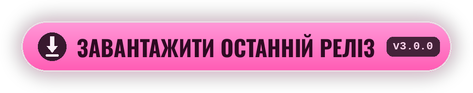

<div align="center">


[<kbd> English </kbd>](../../README.md)
[<kbd> Русский </kbd>](README.ru.md)
<kbd> ● Українська </kbd>
[<kbd> Deutsch </kbd>](README.de.md)
[<kbd> Español </kbd>](README.es.md)
[<kbd> Français </kbd>](README.fr.md)
[<kbd> Polski </kbd>](README.pl.md)
[<kbd> Português </kbd>](README.pt.md)
[<kbd> Türkçe </kbd>](README.tr.md)
[<kbd> Tiếng Việt </kbd>](README.vi.md)
[<kbd> 中文 </kbd>](README.zh.md)
[<kbd> 日本語 </kbd>](README.ja.md)
[<kbd> 한국어 </kbd>](README.ko.md)

<br>

[](https://github.com/elofaster/sarahs-house-i18n/releases/latest)

[](https://github.com/BepInEx/BepInEx)

Мод перекладає **Sarah's House** 12 мовами. Мова обирається під час першого запуску,
далі змінюється через **F10** у головному меню. Файли гри мод не чіпає.

<a href="https://github.com/elofaster/sarahs-house-i18n/releases/latest"></a>


</div>


1. Завантажте `SarahsHouse-i18n-v3.0.0.zip` зі [сторінки релізів](https://github.com/elofaster/sarahs-house-i18n/releases/latest).
2. Розпакуйте архів у теку гри — туди, де лежить `SarahsHouse.exe`.
3. Запустіть гру. Перший запуск довший за звичайний, хвилина-дві: BepInEx один раз налаштовується під вашу копію. Далі меню вибору мови відкриється саме.

Має вийти так:

```text
SarahsHouse/
├─ SarahsHouse.exe          ← гра
├─ winhttp.dll              ┐
├─ doorstop_config.ini      │  з архіву
├─ dotnet/                  │
└─ BepInEx/                 ┘
```

<details>
<summary>Уже стоїть BepInEx 6 IL2CPP</summary>
<br>

Достатньо скопіювати `SarahsHouseI18n/` у `BepInEx/plugins/`. Деталі — у [docs/INSTALL.md](../INSTALL.md).

</details>

<br>


Усі 12 мов перекладені моделлю **Claude Opus 4.8** (Anthropic) — повністю, близько 15 000 рядків на кожну мову.

Переклад робився не порядково: модель бачить сцену цілком, тому репліки зберігають характер персонажів. Opus 4.8 — флагманська модель Anthropic, одна з найсильніших у перекладі на сьогодні.

<br>


<details>
<summary>Перший запуск дуже довгий</summary>
<br>

Так і має бути: BepInEx генерує збірки під вашу копію гри. Це разова операція, всі наступні запуски — звичайні.

</details>
<details>
<summary>Антивірус свариться на <code>winhttp.dll</code></summary>
<br>

Це завантажувач BepInEx, стандартний для Unity-модів. Поверніть файл із карантину та додайте теку гри у винятки.

</details>
<details>
<summary>Після оновлення гри частина тексту знову англійською</summary>
<br>

Нові та змінені рядки ще не перекладені — вони показуються англійською, гра при цьому працює нормально. Оновіть мод, коли вийде свіжа версія.

</details>
<details>
<summary>Як видалити мод</summary>
<br>

Видаліть теку `BepInEx/plugins/SarahsHouseI18n`. Якщо хочете прибрати й сам BepInEx — видаліть ще `winhttp.dll`. Гра повернеться до початкового стану.

</details>

<br>


Пакети перекладів — звичайні JSON у [`packs/`](../../packs): ключ — англійський рядок, значення — переклад. У встановленому моді ті самі файли лежать у `BepInEx/plugins/SarahsHouseI18n/i18n/` — правка видна після перезапуску гри.

Нова мова додається без перезбирання мода — інструкція в [docs/ADD-LANGUAGE.md](../ADD-LANGUAGE.md). Пул-реквести вітаються.


**Sarah's House** робить **AceStudio** — мод містить лише переклад, сама гра до нього не входить.

Якщо переклад став вам у пригоді, підтримайте розробника: купіть гру та залиште відгук.

[Steam](https://store.steampowered.com/app/4712060/Sarahs_House) · [itch.io](https://ace-stud.itch.io/sarahs-house)

<div align="center">


<a href="https://github.com/elofaster/sarahs-house-i18n"></a>

<a href="https://github.com/elofaster"></a>

шрифти — SIL OFL / Apache 2.0, список у [THIRD-PARTY-NOTICES.md](../../THIRD-PARTY-NOTICES.md) · працює на [BepInEx](https://github.com/BepInEx/BepInEx)

До автора гри стосунку не маю.

</div>
