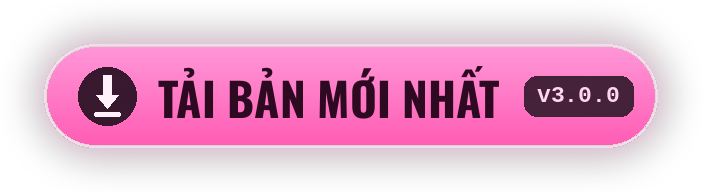

<div align="center">


[<kbd> English </kbd>](../../README.md)
[<kbd> Русский </kbd>](README.ru.md)
[<kbd> Українська </kbd>](README.uk.md)
[<kbd> Deutsch </kbd>](README.de.md)
[<kbd> Español </kbd>](README.es.md)
[<kbd> Français </kbd>](README.fr.md)
[<kbd> Polski </kbd>](README.pl.md)
[<kbd> Português </kbd>](README.pt.md)
[<kbd> Türkçe </kbd>](README.tr.md)
<kbd> ● Tiếng Việt </kbd>
[<kbd> 中文 </kbd>](README.zh.md)
[<kbd> 日本語 </kbd>](README.ja.md)
[<kbd> 한국어 </kbd>](README.ko.md)

<br>

[](https://github.com/elofaster/sarahs-house-i18n/releases/latest)

[](https://github.com/BepInEx/BepInEx)

Mod dịch **Sarah's House** sang 12 ngôn ngữ. Ngôn ngữ được chọn ở lần chạy đầu,
sau đó đổi bằng **F10** trong menu chính. Mod không đụng vào file game.

<a href="https://github.com/elofaster/sarahs-house-i18n/releases/latest"></a>


</div>


1. Tải `SarahsHouse-i18n-v3.0.0.zip` từ [trang phát hành](https://github.com/elofaster/sarahs-house-i18n/releases/latest).
2. Giải nén vào thư mục game — nơi có `SarahsHouse.exe`.
3. Khởi động game. Lần chạy đầu lâu hơn bình thường một-hai phút: BepInEx tự thiết lập một lần cho bản của bạn. Sau đó menu chọn ngôn ngữ tự mở.

Kết quả sẽ như thế này:

```text
SarahsHouse/
├─ SarahsHouse.exe          ← game
├─ winhttp.dll              ┐
├─ doorstop_config.ini      │  từ file nén
├─ dotnet/                  │
└─ BepInEx/                 ┘
```

<details>
<summary>Đã có sẵn BepInEx 6 IL2CPP</summary>
<br>

Chỉ cần chép `SarahsHouseI18n/` vào `BepInEx/plugins/`. Chi tiết: [docs/INSTALL.md](../INSTALL.md).

</details>

<br>


Cả 12 ngôn ngữ đều do mô hình **Claude Opus 4.8** (Anthropic) dịch — trọn vẹn, khoảng 15 000 dòng mỗi ngôn ngữ.

Bản dịch không làm theo từng dòng: mô hình nhìn cả phân cảnh, nên lời thoại giữ đúng cá tính nhân vật. Opus 4.8 là mô hình chủ lực của Anthropic và là một trong những mô hình dịch mạnh nhất hiện nay.

<br>


<details>
<summary>Lần chạy đầu rất lâu</summary>
<br>

Đúng như vậy: BepInEx đang sinh assembly cho bản game của bạn. Việc này chỉ diễn ra một lần — các lần sau khởi động bình thường.

</details>
<details>
<summary>Phần mềm diệt vi-rút phàn nàn về <code>winhttp.dll</code></summary>
<br>

Đó là bộ nạp của BepInEx, tiêu chuẩn với mod Unity. Khôi phục file khỏi vùng cách ly và thêm thư mục game vào ngoại lệ.

</details>
<details>
<summary>Sau khi game cập nhật, một phần chữ lại là tiếng Anh</summary>
<br>

Các dòng mới và bị đổi chưa được dịch — chúng hiện bằng tiếng Anh, game vẫn chạy bình thường. Cập nhật mod khi có bản mới.

</details>
<details>
<summary>Cách gỡ mod</summary>
<br>

Xoá thư mục `BepInEx/plugins/SarahsHouseI18n`. Muốn gỡ cả BepInEx thì xoá thêm `winhttp.dll`. Game trở về trạng thái ban đầu.

</details>

<br>


Các gói dịch là file JSON thuần trong [`packs/`](../../packs): khoá là câu tiếng Anh, giá trị là bản dịch. Ở bản đã cài, chính các file đó nằm trong `BepInEx/plugins/SarahsHouseI18n/i18n/` — sửa xong khởi động lại game là thấy.

Có thể thêm ngôn ngữ mới mà không cần build lại mod — hướng dẫn: [docs/ADD-LANGUAGE.md](../ADD-LANGUAGE.md). Hoan nghênh pull request.


**Sarah's House** do **AceStudio** phát triển — mod chỉ chứa bản dịch, không kèm theo game.

Nếu bản dịch hữu ích với bạn, hãy ủng hộ nhà phát triển: mua game và để lại đánh giá.

[Steam](https://store.steampowered.com/app/4712060/Sarahs_House) · [itch.io](https://ace-stud.itch.io/sarahs-house)

<div align="center">


<a href="https://github.com/elofaster/sarahs-house-i18n"></a>

<a href="https://github.com/elofaster"></a>

phông chữ — SIL OFL / Apache 2.0, danh sách: [THIRD-PARTY-NOTICES.md](../../THIRD-PARTY-NOTICES.md) · chạy trên [BepInEx](https://github.com/BepInEx/BepInEx)

Tôi không liên quan đến tác giả game.

</div>
